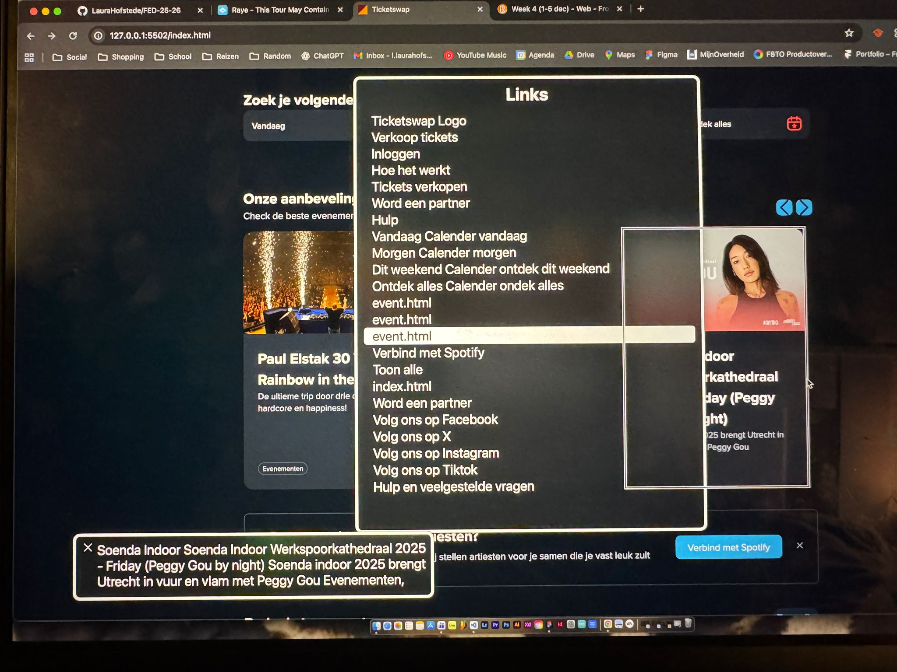
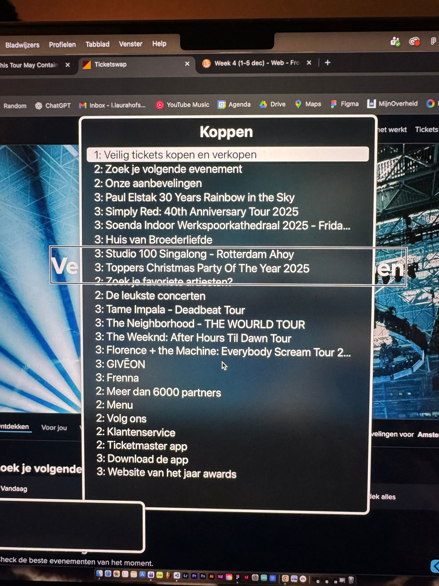
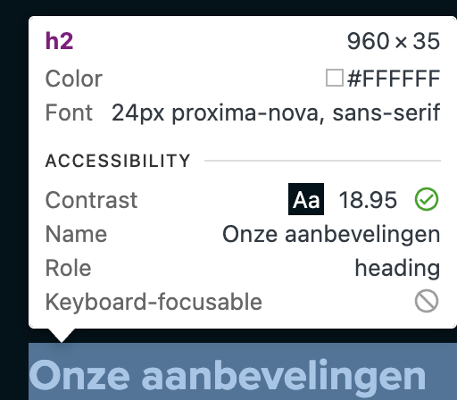
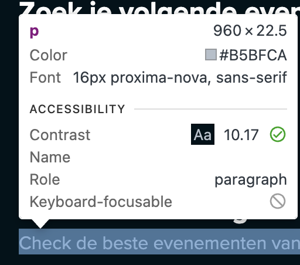
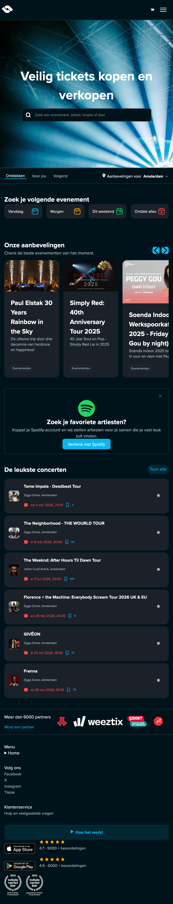

# Procesverslag
Markdown is een simpele manier om HTML te schrijven.  
Markdown cheat cheet: [Hulp bij het schrijven van Markdown](https://github.com/adam-p/markdown-here/wiki/Markdown-Cheatsheet).

Nb. De standaardstructuur en de spartaanse opmaak van de README.md zijn helemaal prima. Het gaat om de inhoud van je procesverslag. Besteedt de tijd voor pracht en praal aan je website.

Nb. Door *open* toe te voegen aan een *details* element kun je deze standaard open zetten. Fijn om dat steeds voor de relevante stuk(ken) te doen.

## Jij

  
uitwerken voor kick-off werkgroep

  ### Auteur:
  Laura Hofstede

  #### Je startniveau:
  Rood

  #### Je focus:
  poging tot beide responsive en surface plane
 

## Je website

  
uitwerken voor kick-off werkgroep

  ### Je opdracht:
  link naar de website die je gaat namaken óf de naam/omschrijving van je eigen ontwerp

  #### Screenshot(s) van de eerste pagina (small screen): 
  hier de naam van de pagina  
    

  #### Screenshot(s) van de tweede pagina (small screen):
  hier de naam van de pagina  
  
 

## Toegankelijkheidstest 1/2 (week 1)

  
uitwerken na test in 2e werkgroep

  ### Bevindingen
    Bevindingen toegankelijkheid van website Ticketswap

    Screenreader: Ik vond het redelijk lastig om met de screenreader te werken. Het leest echt alles op wat er op de pagina staat. Toen ik de website in de zoekbalt aan het typen was werden de extra tekens ook opgelezen, hierdoor vond ik het moeilijk te begrijpen wat er nou echt gebeurde op het scherm omdat je zo veel hoort. Ik denk dat als ik slechtziende was ik heel snel overprikkeld hiervan zou raken. Ik vond het werken met de controlls ook wel redelijk ingewikkeld omdat je op mac een aantal knoppen tergelijkertijd moet gebruiken, dit was even wennen.

    Bevindingen website: Het logo werd als een link opgelezen inplaats van de naam van de website zelf. De menubalk werd aangegeven als link en een lijst met 5 onderdelen, ik wist nu niet wat voor lijst dit was en waar ik uit kon kiezen zonder hier in te gaan. Toen ik op een link in de lijst klikte ging ik naar de pagina. Toen last het voor ‘’Je bevind je momenteel op een webmateriaal in een groep.’’ Ik heb geen idee wat dat zou moeten betekenen. Verder op de homepagina. na de menubalk ging het over naar de zoekbalk, hier bleef ik in hangen en ik wist even niet hoe ik verder moest met de pagina navigeren. Toen ik verder ging met TAB ging het alleen door de links op de pagina heen, niet de teksten zelf. Het sloeg dus een aantal dingen over waardoor ik deze niet aan kon klikken.

    WCAG Checklist: De content van de website is prima. De afbeeldigen hebben goede alt teksten. En verder voldoet de code grotendeels aan de checklist.

    Contrast-ratio: Headings: 18.95 / Normale tekst: 10.17. ‘’Passes AAA level for any size text and AA for user interface components and graphical objects’’ Deze zijn dus beide goed.

    Kleurblindheid: Ik heb getest met alle opties, in alle gevallen is de website nogsteeds goed te navigeren, dit komt omdat de titels en de knoppen er duidelijk anders uit zien. Hierdoor kan je ook zonder kleurverschil zien dat het iets anders is dan normale tekst. Ook heb ik gekeken hoe het er uit zag met een laag contrast. De tekst is nogsteeds te lezen omdat de contrast ratio goed is.

## Breakdownschets (week 1)

  
uitwerken na afloop 3e werkgroep

  ### de hele pagina: 
  

  
  Hier de onderdelen die ik van de homepagina ga maken

  ### dynamisch deel (bijv menu): 
  

  ### wellicht nog een dynamisch deel (bijv filter): 
  

## Voortgang 1 (week 2)

  
uitwerken voor 1e voortgang - HERKANSING

  ### Stand van zaken
  Week 1 - De code schrijven ging redelijk goed, af en toe moest ik even nadenken wat voor stukje code ik moest gebruiken. Sommige delen weet ik nog niet hoe ik dit moet gaan maken zoals de ropdown menus. 
  Ik ben ook alvast begonnen aan de css code schrijven zodat het al een beetje werkt op mobiel en desktop.

  Herkansing - Code schrijven gaat goed, loop vast op moeilijkere dingen waar ik dan langer mee bezig ben om uit te zoeken hoe het moet omdat ik nu al heel veel code heb is het af en toe wat onoverzichtelijk geworden. 

  ### Agenda voor meeting
  - Waar komt mijn grid columns vandaan? Niks werkt.
  - Div vervangen door wat hier?
  - hoe krijg ik deze naast elkaar en niet op elkaar??
  - Moet een p persee gebruikt worden in een li of mag dat ook zo?

  

  ### Verslag van meeting

  - ik heb weer een aantal verbeterpuntjes geleerd zoals de grid en de volgorde van mijn code voor selectors

## Voortgang 2 (week 3)

  
uitwerken voor 2e voortgang

  ### Stand van zaken
  Het ging goed om de meeste delen van mijn website responsive te maken en goed kloppend te maken met css opmaakt. Ik heb wel nog wat moeite puntjes met dingen die ik niet helemaal snap of dingen die beter kunnen. Mijn pagina heeft een bepaalde breedte en ik wist niet hoe ik dit goed kon doen, na het te vragen snap ik dit nu.

  ### Agenda voor meeting
  samen met je groepje opstellen

  ####Laura    
  - Ik heb meerdere divs gebruikt in mijn html omdat ik anders het niet goed gepositioneerd kreeg met de opmaakt van bv flex, mag dit dan wel? 
  - Hoe kan ik mijn header met bepaalde breedte de svg in het menu wel en niet tonen. mag dit met display none?
  - Ik heb pijltjes in mijn carousel nodig maar die krijg ik niet gepositioneerd, hoe doe ik dit?
  - Bij mijn spotify section is er nog een kruisje die het sluit, moet dit werken? Hoe krijg ik deze rechts in de hoek gepositioneerd?

  ####Yenthe
  - Hoe kunnen mijn afbeeldingen mee schalen zodat ze langer worden in de lengte?
  - Hoe positioneren met display grid
  
  ####Arpine
  - hoe kan ik ervoor zorgen dat de plaatjes in de carousel dezelfde grootte zijn?
  - waarom krijgt de grid een extra column erbij als er niks in zit?

  ####Omra
  - hoe krijg ik de h2 van sectie vier onder de image
  - Op mobile is section vijf een hele blok, maar als je hem groter maakt zijn het aparte blokken. Moet dit met css worden veranderen of html?
  - Hoe verander je de lettertype van de a in adress, de font is wel geselcteerd met de a maar het wordt niet gewizjigd. (adress weg doen?)

  ### Verslag van meeting
  Object-fit: cover; voor afbeeldingen passend te maken
  divs mogen alleen op de delen waar het niet anders kan voor de css opmaak

  grid-template-columns:1fr min(100% - 2em, 20em) 1fr;
  om een colom te maken die een deel van de pagina gebruikt. Dus voor secties die de hele breedte gebruiken en voor secties die een deel gebruiken is dit handig.

  nieuwe termen die ik heb geleerd te gebruiken
  clamp () 
  anchor-name: --carousel;
  flex-basis: 33.33%;
  position-area: top;
  https://utopia.fyi/ is handig voor het automatisch responsive maken van delen van je website.

## Toegankelijkheidstest 2/2 (week 4)

  
uitwerken na test in 9e werkgroep

  ### Bevindingen
  WCAG Checklist / screenreader: 
  - De content en global code kloppen
  - Alle img hebben nu een correcte alt tekst
  - Links en buttons hebben een passende arialabel als de tekst nog niet duidelijk genoeg was
  

  - De heading levels kloppen met maar 1 h1 per pagina
  

  - Het is duidelijk waar je bent als je met tab door de pagina heen gaat door de omlijning
  - Op mobiel kan je nogsteeds door het dichte hamburgermenu heen met tab terwijl het display none heeft? (oplossen met Skiplink?)

  Contrast-ratio: 
  - De headings hebben een contrast van 18.95
  - Normale tekst heeft een contrast van 10.17
  - Deze zijn dus goed
  
  

  Kleurblindheid: 
  - De website is nogsteeds goed te navigeren omdat de contrast ratio goed is
  - De knoppen zien er ook duidelijk uit als knoppen en de kleur maakt dus niet veel uit 

## Voortgang 3 (week 4)

  
uitwerken voor 3e voortgang

  ### Stand van zaken
  Ik vind het nog lastig om voor delen geen divs te gebruiken voor de styling omdat ik het voornamelijk met flex heb aangeleerd. Nu moet ik veel meer gebruik maken van grid's. Het lukt me uiteindelijk wel om het aan te passen maar het kost me veel meer moeite om het goed eruit te laten zien.

  ### Agenda voor meeting
  samen met je groepje opstellen

  ####Laura
  - Het verwijderen van een element uit de DOM met js lukt me niet goed om responsive te maken.
  - Ik heb 2 divs gebruikt voor makkelijke opmaak, hoe kan ik dit op een betere manier doen?
  - Hoe download ik de svg code naar een img?

  ####Yenthe
  - hoe gaat het scrollen bij mijn carousel weg?  
  - Hoe maak ik ruimte aan de linker en rechter kan van de 4 list items (header)? 
  - Grid in footer werkt niet?

  ####Arpine
  - kan een h3 en img ook als een link gemaakt worden en hoe doe je het dan positioneren

  ####Omra
  - hoe krijg ik de carousel vakjes even groot?
  - Hoe maak ik een border line langer?
  - hoe verwijder ik onnodige witruimte bij de P

  ### Verslag van meeting
  - De JS code die ik had om een element te verwijderen uit mijn html op desktop versie mag ik niet gebruiken. 
  - Hoe je een element correct uit de pagina kan verwijderen zonder de visibilty hidden kan met de display none, dan ziet de screenreader dit niet.
  - De divs weghalen en een grid gebruiken, elke regel dan in de css aanwijzen welke positie die moet hebben. Hoe je de 2e div weg krijgt moet ik ook aan Sanne vragen. 

## Eindgesprek (week 5)

  
uitwerken voor eindgesprek

  ### Je uitkomst - karakteristiek screenshots:
  
  

  ### Dit ging goed/Heb ik geleerd: 
  De algemene layout en opmaak ging goed. Ik heb geleerd om met grid te werken bij dingen waar ik eerst meer divs en flex voor zou gebruiken, ik kan dus de code meer clean schrijven nu. Ook heb ik meerdere kleine dingen geleerd om iets simpeler te doen of betere code.

  

  ### Dit was lastig/Is niet gelukt:
  Sommige dingen goed te positioneren of te laten werken vond ik lastig. Vooral bij de carousel v=bij het stukje aanbevelingen op de homepagina, ik kreeg deze niet goed gepositioneerd met de hoogte en breedte dus nu klopt het niet helemaal als je met de pijltjes klikt. Het werkt wel en ziet er prima uit maar het is niet perfect. Ik vond het ook nog wat lastig om geen classes te gebruiken, nu moest ik goed nadenken over welke selector ik nodig had en hier zullen vast nog wel wat foutjes in zitten of dingen die ik beter had kunnen gebruiken. 

  

## Bronnenlijst

  
continu bijhouden terwijl je werkt

  Nb. Wees specifiek ('css-tricks' als bron is bijv. niet specifiek genoeg). 
  Nb. ChatGpT en andere AI horen er ook bij.
  Nb. Vermeld de bronnen ook in je code.

  1. bron 1
  2. https://developer.mozilla.org/en-US/docs/Web/HTML/Reference/Elements/select - The HTML Select element - Uitleg op de mdn website gebruikt voor mijn select knop voor de stad op de homepagina.
  3. https://chrome.dev/anchor-tool/ - Anchor Position tool -> uitleg op de site gebruikt voor het positioneren van de scroll buttons, maar voornamelijk Sanne zijn hulp hiervoor gebruikt 

